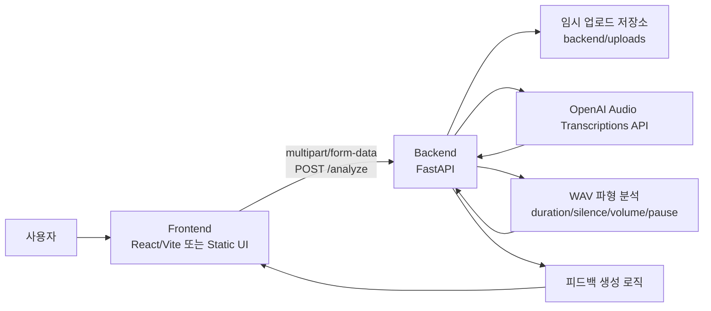

# Presentation Coach 기술 아키텍처 문서

## 1. 프로젝트 개요

Presentation Coach는 발표 음성 파일을 업로드하면 음성 인식(STT)과 오디오 파형 분석을 통해 발표 피드백을 제공하는 웹 애플리케이션이다.

현재 버전은 로컬 MVP 단계이며, 핵심 목표는 다음과 같다.

- 발표 음성 파일 업로드
- OpenAI STT를 통한 한국어 발화 텍스트 추출
- WAV 파형 기반 길이, 침묵 비율, 긴 멈춤, 볼륨 분석
- 습관어, 말하기 속도, 개선점, 다음 연습 과제 제공

이 프로젝트는 React 개발자가 빠르게 이해하고 확장할 수 있도록 프론트엔드와 백엔드를 명확히 분리했다.

## 2. 전체 아키텍처



### 요청 흐름

1. 사용자가 프론트엔드에서 음성 파일을 선택한다.
2. 프론트엔드는 `FormData`로 `POST http://localhost:8000/analyze` 요청을 보낸다.
3. FastAPI 백엔드는 파일을 `backend/uploads`에 저장한다.
4. 백엔드는 OpenAI STT API로 transcript를 생성한다.
5. 동시에 WAV 파일의 파형을 분석해 길이, 침묵 비율, 긴 멈춤, 볼륨을 계산한다.
6. transcript와 metrics를 기반으로 피드백을 생성한다.
7. 프론트엔드는 결과를 카드 형태로 표시한다.

## 3. 기술 스택

### Frontend

- React
- TypeScript
- Vite
- lucide-react
- 로컬 테스트용 static HTML/JS/CSS

React/Vite 버전은 실제 앱 개발을 위한 기본 구조이고, `frontend/static`은 npm 실행 환경이 없을 때도 로컬 테스트가 가능하도록 만든 정적 버전이다.

### Backend

- Python
- FastAPI
- Uvicorn
- python-multipart
- python-dotenv
- OpenAI Python SDK
- Python 표준 라이브러리 `wave`, `struct`, `math`

FastAPI는 파일 업로드 API를 간단하게 만들 수 있고, React 프론트엔드와 JSON으로 통신하기 쉽다. Python은 STT 연동, 오디오 분석, AI 처리 확장에 적합하다.

### External API

- OpenAI Audio Transcriptions API
- 기본 모델: `gpt-4o-mini-transcribe`

환경변수로 `OPENAI_TRANSCRIPTION_MODEL`을 바꾸면 다른 transcription 모델로 교체할 수 있다.

## 4. 폴더 구조

```text
presentation-coach/
  backend/
    app/
      main.py
      services/
        analysis.py
        audio_metrics.py
        feedback.py
        storage.py
        transcription.py
    uploads/
    .env.example
    requirements.txt
    run_backend.cmd
    run_backend.ps1

  frontend/
    src/
      App.tsx
      main.tsx
      styles.css
    static/
      index.html
      main.js
      styles.css
    package.json
    run_frontend_static.cmd
    run_frontend_static.ps1

  docs/
    technical-architecture.md
```

## 5. Backend 설계

### `main.py`

FastAPI 앱의 진입점이다.

- CORS 설정
- 헬스 체크 `GET /`
- 분석 API `POST /analyze`

`/analyze`는 업로드된 음성 파일을 받아 저장한 뒤 `analyze_recording()`을 호출한다.

### `storage.py`

업로드 파일을 `backend/uploads`에 저장한다.

- UUID 기반 파일명 사용
- 원본 확장자 유지
- 대용량 파일을 한 번에 메모리에 올리지 않도록 chunk 단위 저장

### `analysis.py`

백엔드 분석 흐름을 조율한다.

```text
save_upload
  -> transcribe_audio
  -> get_audio_metrics
  -> build_feedback
  -> JSON response
```

API 응답은 다음 주요 필드를 가진다.

```json
{
  "filename": "sample.wav",
  "transcript": "...",
  "transcription": {
    "status": "completed",
    "message": "STT가 완료되었습니다.",
    "model": "gpt-4o-mini-transcribe"
  },
  "metrics": {},
  "feedback": {}
}
```

### `transcription.py`

OpenAI STT 연결을 담당한다.

- `.env`에서 `OPENAI_API_KEY` 로드
- 기본 모델은 `gpt-4o-mini-transcribe`
- `language="ko"`로 한국어 인식 힌트 제공
- 키가 없거나 STT 실패 시 앱이 죽지 않고 fallback 상태 반환

현재 상태 값은 다음과 같다.

- `completed`: STT 성공
- `empty`: STT 응답은 성공했지만 transcript가 비어 있음
- `missing_api_key`: API 키 없음
- `failed`: STT 호출 실패

### `audio_metrics.py`

WAV 파일의 실제 파형을 분석한다.

계산하는 주요 지표:

- `durationSeconds`: 음성 길이
- `silenceRatio`: 전체 중 침묵 구간 비율
- `estimatedPauseCount`: 0.7초 이상 이어지는 긴 침묵 수
- `averageVolumePercent`: 평균 RMS 볼륨
- `peakVolumePercent`: 최대 볼륨
- `wordsPerMinute`: STT transcript 기반 분당 단어 수
- `fillerCounts`: 습관어 빈도

현재 파형 분석은 WAV 파일에 가장 안정적으로 동작한다. MP3/M4A 등은 STT는 가능하지만 파형 지표는 제한될 수 있다.

### `feedback.py`

metrics와 transcript를 바탕으로 사용자에게 보여줄 코칭 문장을 만든다.

현재 피드백 기준:

- 45초 이상이면 발표 흐름 분석에 충분한 길이로 판단
- 침묵 비율이 12%~35%면 적절한 여백으로 판단
- 침묵이 너무 적으면 핵심 문장 뒤 pause를 권장
- 침묵이 너무 많으면 망설임 또는 불필요한 공백 가능성을 안내
- 평균 볼륨이 낮으면 마이크 거리 또는 입력 볼륨 개선 권장
- 최대 볼륨이 높으면 clipping 가능성 안내
- STT transcript가 있으면 말하기 속도와 습관어를 추가 분석

## 6. Frontend 설계

### React/Vite UI

`frontend/src/App.tsx`는 실제 React 앱의 핵심 화면이다.

주요 역할:

- 파일 선택
- `/analyze` API 요청
- loading/error 상태 관리
- metrics 카드 표시
- transcript 표시
- 습관어 표시
- 좋은 점/개선할 점/다음 연습 표시

### Static UI

`frontend/static`은 npm 없이도 로컬 테스트가 가능하도록 만든 버전이다.

현재 로컬 실행은 다음 파일을 사용한다.

```powershell
D:\WORK\presentation-coach\frontend\run_frontend_static.cmd
```

이 구조는 개발 초기 환경 문제를 피하기 위한 임시 운영 방식이며, Node/npm 환경이 안정화되면 React/Vite dev server 중심으로 통합하는 것이 좋다.

## 7. 환경 설정과 보안

### API 키 관리

실제 키는 다음 파일에 저장한다.

```text
backend/.env
```

예시:

```text
OPENAI_API_KEY=sk-...
OPENAI_TRANSCRIPTION_MODEL=gpt-4o-mini-transcribe
```

`.env`는 `.gitignore`에 포함되어 있으므로 GitHub에 올라가지 않는다. 공개 저장소에 API 키를 커밋하면 즉시 폐기하고 새 키를 발급해야 한다.

### 로컬 실행

백엔드:

```powershell
cd D:\WORK\presentation-coach\backend
.\run_backend.ps1
```

프론트 정적 서버:

```powershell
cd D:\WORK\presentation-coach\frontend
.\run_frontend_static.ps1
```

현재 테스트 URL:

```text
Frontend: http://127.0.0.1:5173
Backend:  http://127.0.0.1:8000
```

## 8. 발표 분석 도메인 배경 지식

발표 코칭은 크게 두 종류의 데이터를 사용한다.

### 오디오 파형 기반 지표

음성의 실제 소리 데이터를 분석한다.

- 길이: 발표가 충분히 긴지 판단
- 침묵: 너무 급하게 말하는지, 망설임이 많은지 판단
- 볼륨: 마이크 입력 품질과 발성 크기 판단
- 긴 멈춤: 의도적인 pause인지, 흐름이 끊기는 hesitation인지 판단

이 지표는 STT 없이도 계산할 수 있지만, “무슨 말을 했는지”는 알 수 없다.

### 텍스트 기반 지표

STT transcript를 분석한다.

- 말하기 속도: 분당 단어 수
- 습관어: “음”, “어”, “그”, “약간”, “뭔가” 등
- 문장 구조: 도입, 본론, 결론
- 반복 표현: 같은 단어 또는 표현의 과다 사용
- 논리 흐름: 주장, 근거, 예시, 결론의 연결

이 지표는 실제 발표 내용에 대한 코칭을 가능하게 한다.

### 좋은 발표 피드백의 원칙

좋은 피드백은 단순한 점수보다 “다음 녹음에서 무엇을 바꾸면 되는지”가 분명해야 한다.

예:

- 나쁜 피드백: “말이 빠릅니다.”
- 좋은 피드백: “핵심 주장 뒤에 1초 멈추세요. 특히 첫 번째 주장과 결론 직전에 pause를 넣어 보세요.”

이 프로젝트의 피드백 구조도 그래서 `strengths`, `improvements`, `practiceTasks`로 나뉜다.

## 9. 현재 한계

- WAV가 아닌 파일은 파형 분석이 제한적이다.
- STT transcript의 단어 수 계산은 한국어 특성상 공백 기준이므로 정교하지 않다.
- 습관어 탐지는 단순 문자열 포함 횟수 기반이다.
- 발표 구조 분석은 아직 LLM 기반으로 확장되지 않았다.
- 업로드 파일 정리 정책이 아직 없다.
- 사용자별 기록 저장소가 없다.

## 10. 다음 개발 방향

우선순위가 높은 개선 방향은 다음과 같다.

1. MP3/M4A를 WAV로 변환하는 오디오 전처리 추가
2. STT timestamp 기반 구간별 말 빠르기 분석
3. 습관어 위치와 빈도를 타임라인으로 표시
4. LLM을 이용한 발표 구조 피드백 추가
5. 사용자별 분석 이력 저장
6. React/Vite dev server 중심으로 프론트 실행 방식 정리
7. 테스트 코드 추가
8. 업로드 파일 자동 정리 정책 추가

## 11. 운영 관점 체크리스트

- API 키는 `.env`에만 보관한다.
- 업로드 파일은 개인정보가 포함될 수 있으므로 저장 기간을 제한한다.
- STT 호출 비용이 발생하므로 파일 크기와 길이 제한이 필요하다.
- production 배포 시 CORS origin을 실제 프론트 도메인으로 제한한다.
- 로그에 transcript 또는 API 키가 노출되지 않도록 주의한다.
